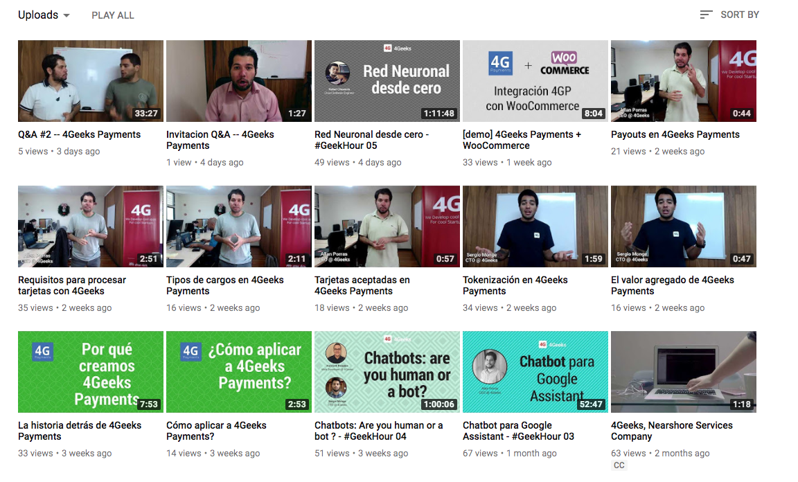

Videos
======

Regularmente estamos creando videos que ayude a entender conceptos básicos
de 4Geeks Payments, así como videos explicativos que ayuden a desarrolladores
de software con las tareas regulares para integrar 4GP con su sistema actual.

Entonces, en este `playlist <https://www.youtube.com/playlist?list=PLU3gLSoIVU8Zv0eyipORNTXrxmw8AbfNw>`_
puedes encontrar los videos relacionados a 4GP que hasta el momento
hemos publicado.

Te sugiero que te suscribas al canal en `YouTube <https://www.youtube.com/c/4geeksinfo>`_
para que veas los próximos video tutoriales que publicaremos.

